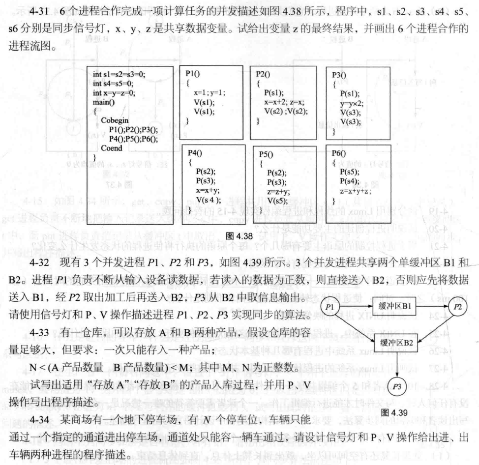
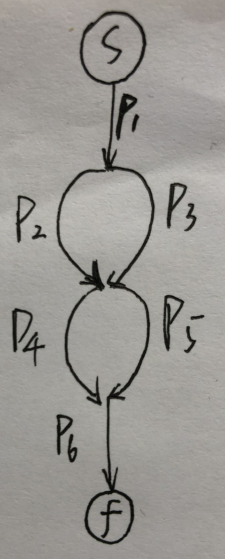
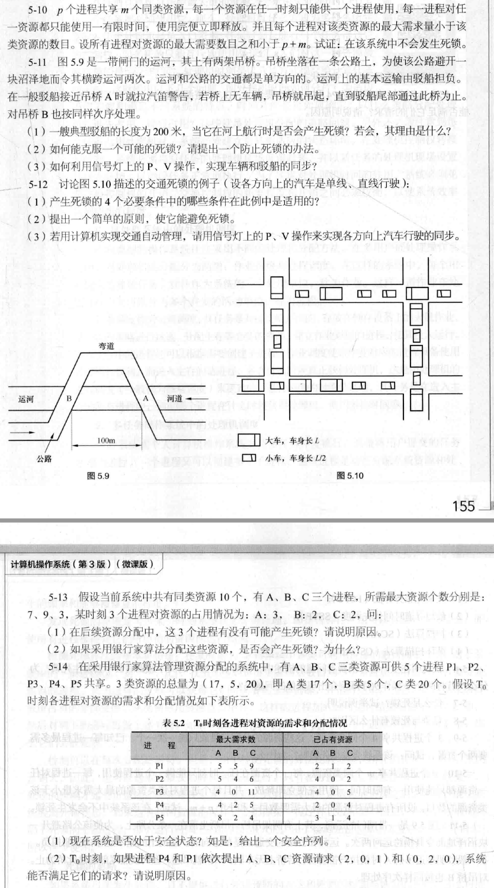
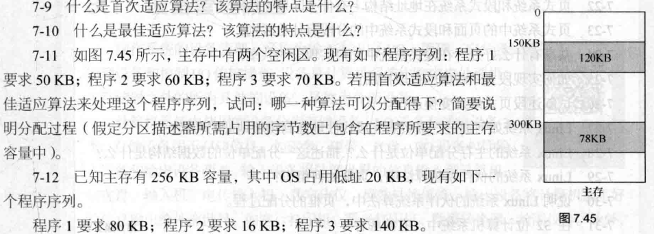

# 操作系统第2次作业



## 4.31

$z=10$



## 4.32

```c
main() {
    int s1=0; //表示缓冲区B1有没有数据
    int s2=0; //表示缓冲区B2有没有数据
    cobegin
        p1();
    	p2();
    	p3();
   	coend
}
p1() {
    while(1) {
        a=input();
        if(a>0) {
            b1 <- a;
        	v(s1);
        } else {
         	b2 <- a;
            v(s2);
        }
    }
}
p2() {
    while(1) {
        p(s1);
        b2 <- b1.front();
        b1.pop_front();
        v(s2);
    }
}
p3() {
    while(1) {
        p(s2);
        output(b2.front())
    }
}
```



## 5.10

$$
Proof:\\
设每个进程所需最大资源数为m_i(0\le m_i\lt m) \\
则\sum_{i=1}^p{m_i}\lt p+m\\
考虑最坏情况下，所有进程都差一个资源，即已用总资源数：\\
sum=\sum_{i=1}^p{(m_i-1)}=\sum_{i=1}^p{m_i}-p\lt m \\
此时仍然至少有1个资源可以分配，然后系统可以将这个资源分配给任意一个进程，\\
这个进程在获得资源有限时间后会释放，随后其他进程也能依次满足资源。\\
因此，该系统中不会发生死锁。
$$

## 5.12

（1）互斥条件、不剥夺条件、占有并等待条件、环路条件

（2）每个路口的红绿灯不同时绿

（3）

```c
main() {
    int s1=s2=s3=s4=0;
    cobegin
        p1();
    	p2();
    	p3();
    	p4();
   	coend
}
p1() {
    p(s1);
    p(s2);
    通行
    v(s1);
    v(s2);
}
p2() {
    p(s2);
    p(s3);
    通行
    v(s2);
    v(s3);
}
p3() {
    p(s3);
    p(s4);
    通行
    v(s3);
    v(s4);
}
p4() {
    p(s4);
    p(s1);
    通行
    v(s4);
    v(s1);
}
```

## 5.13

（1）有可能；如果同时A申请4个资源，B申请7个资源，则无法同时满足。

（2）不会，因为银行家算法只有在检测到系统剩余资源量可满足进程需求时才进行分配

## 5.14

（1）是；$P4\rightarrow P2\rightarrow P3\rightarrow P5\rightarrow P1$

（2）不能；此时A类资源不够。



## 7.11

首次适应算法可以分配得下：首先分配第一个空闲区的50KB，然后分配第一个空闲区的60KB，最后分配第二个空闲区的70KB；

最佳适应算法无法分配得下：首先分配第二个空闲区的50KB，然后分配第一个空闲区的60KB，最后没有足够空闲空间分配70KB。